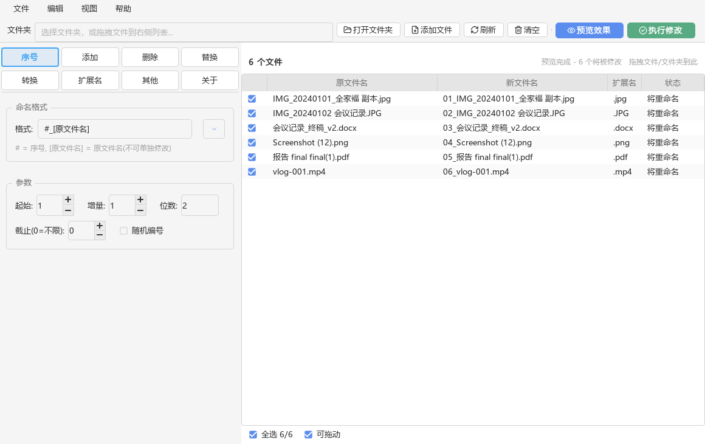
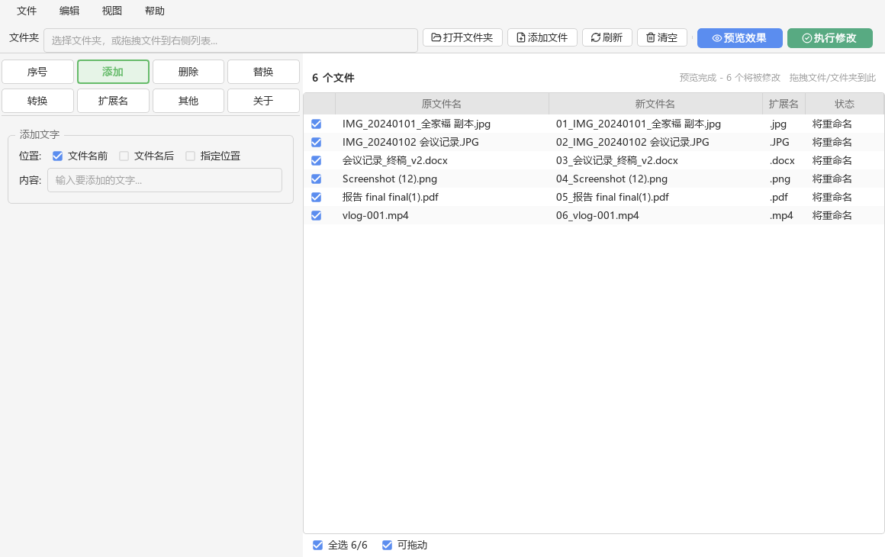
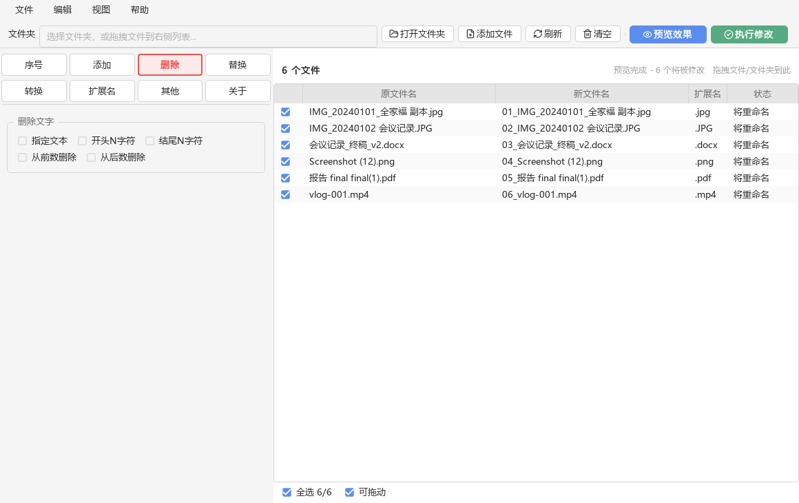
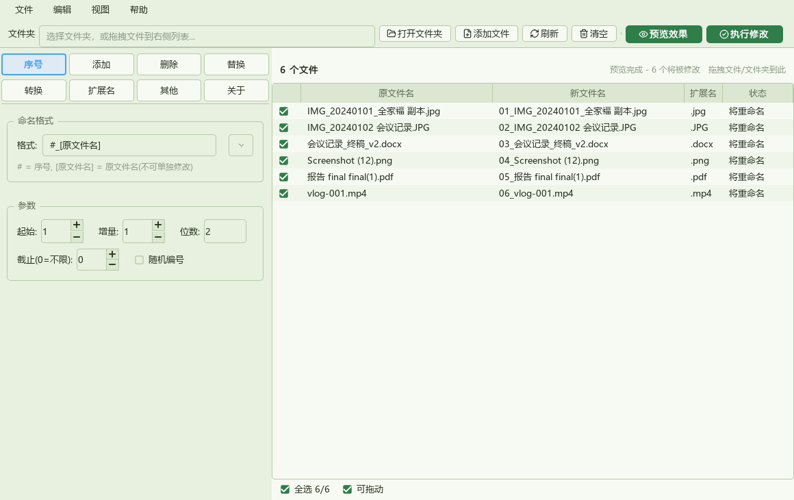
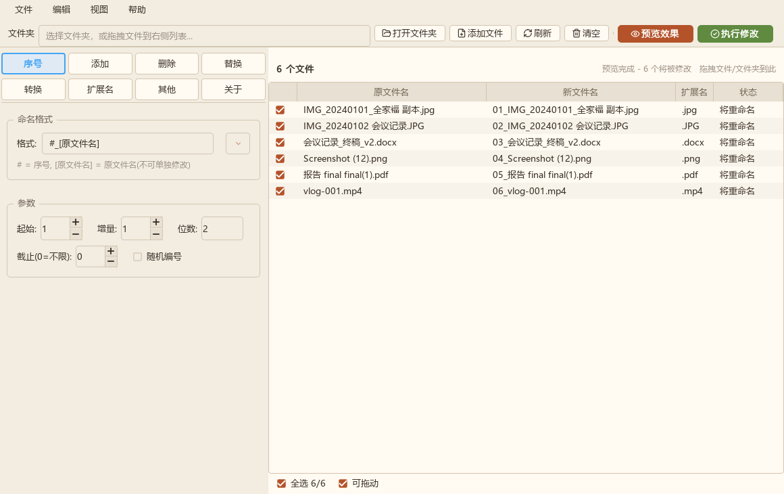
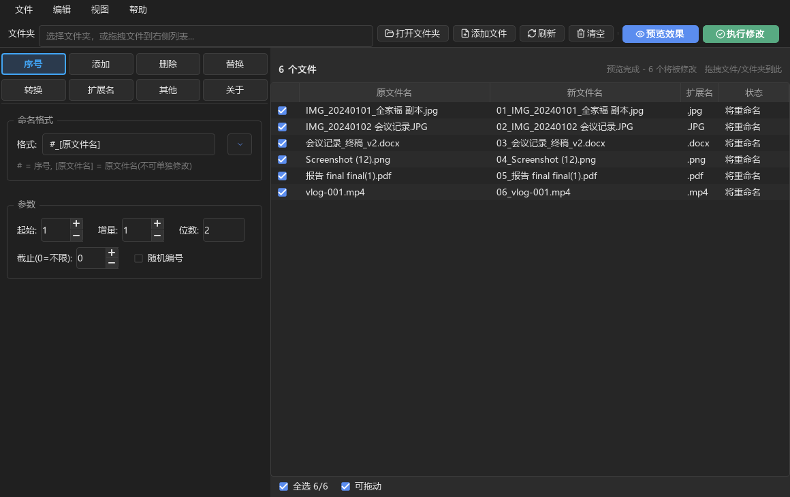
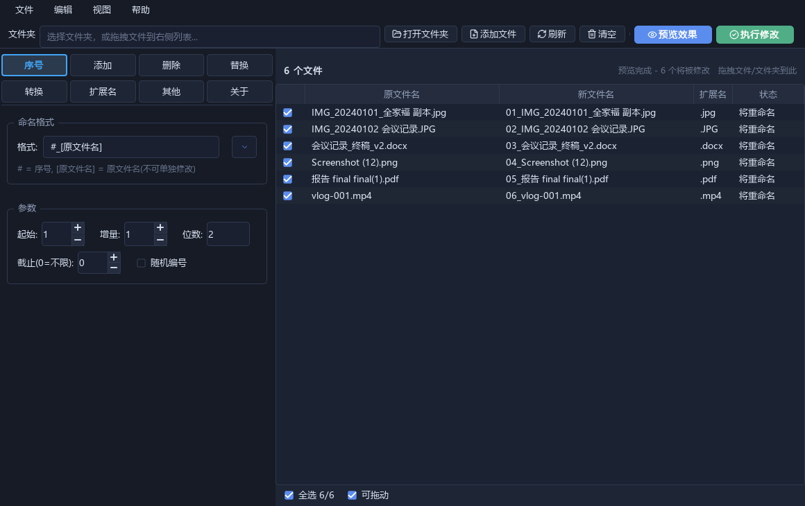
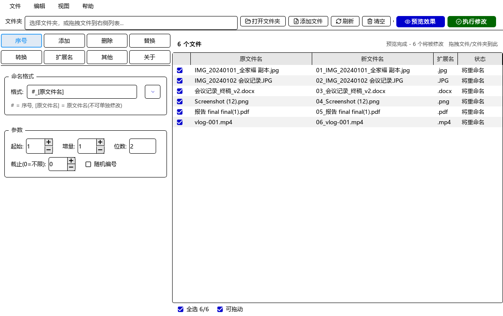

# File Renaming Assistant


> A cross-platform batch file renaming tool built with **PySide6 (LGPL)**.
> Pick a rule on the left, preview the result on the right — **preview first,
> apply second, undo anytime**.

*[中文说明请见 README.md](README.md)*

---

## Features

- **Seven rule pages** — numbering, add text, delete text, find & replace,
  case conversion, change extension, sequential naming.
- **Pixel-matched UI** — 4×2 coloured tab grid on the left, grouped parameter
  panels, and a five-column file table (including an Extension column),
  rebuilt to match the original v4.0 screenshots.
- **Preview before applying** — every change is shown as
  `original → new → status` before anything touches the disk.
- **Conflicts caught early** — a target name that is already taken is flagged
  as *target exists* during preview, instead of failing mid-run.
- **Undo** — built on two-phase commits, so even name swaps (`A↔B`) roll back safely.
- **Drag & drop** — drop files, folders, or a mixed selection.
- **Natural sort** — `img2` comes before `img10`.
- **Six built-in skins** — Classic Light, Eye-care Green, Warm Sand, Classic Dark,
  Midnight Blue and High Contrast. Switch from *View → Skin*; `Ctrl+D` still flips
  between Classic Light and Classic Dark. Your choice is remembered across runs,
  and dialogs no longer go dark-on-dark under a dark system theme.
- **One-click update** — *Help → Check for updates* compares your version with the
  latest GitHub release in a background thread. When a newer build is available it
  can download, verify and install it in place, then restart itself; you can also
  open the release page and update by hand.
- **Headless-testable core** — the engine has zero GUI dependencies.
- **Standard open-source icons** — every UI icon comes from
  [Lucide](https://lucide.dev) (ISC). The SVGs ship with the package and are
  recoloured to the active theme at runtime, so every skin shares one set of
  vectors. The application icon is carried over from the original
  *吃瓜批量改名器* and is **not** covered by this project's MIT licence —
  see the licence note in [README.md](README.md) before redistributing.

## Screenshots

| Numbering | Add | Delete |
|:---:|:---:|:---:|
|  |  |  |

Six built-in skins, switchable from *View → Skin*:

| Classic Light | Eye-care Green | Warm Sand |
|:---:|:---:|:---:|
|  |  |  |

| Classic Dark | Midnight Blue | High Contrast |
|:---:|:---:|:---:|
|  |  |  |

## Quick start

Download the latest `File-Renaming-Assistant.exe` from
[Releases](https://github.com/11113234376457548/File-Renaming-Assistant/releases/latest)
(no Python required), or run from source:

```bash
git clone https://github.com/11113234376457548/File-Renaming-Assistant.git
cd File-Renaming-Assistant
python -m venv .venv && source .venv/bin/activate   # Windows: .venv\Scripts\activate
pip install -r requirements.txt
python main.py
```

## Reusable engine

```python
from renamer.core import RenameEngine, plan_rename, apply_rename, undo

engine = RenameEngine({"tab": 0, "num_fmt": "#_[原文件名]", "num_digits": 3})
plan = plan_rename([("/path/a.jpg", "a.jpg", True)], engine)
print(plan)                 # [('/path/a.jpg', 'a.jpg', '001_a.jpg', '将重命名')]

history = []
apply_rename(plan, history)
undo(history)
```

## Build a standalone binary

```bash
pip install -r requirements-dev.txt
python scripts/build_exe.py     # -> dist/File-Renaming-Assistant.exe
```

Pushing a tag such as `v2.1` triggers
[`.github/workflows/release.yml`](.github/workflows/release.yml), which builds
the Windows executable and publishes it to the Release page.

## Development

```bash
python -m pytest -q      # 176 tests
ruff check .
```

## License

Released under the [MIT License](LICENSE).
The GUI is built on [PySide6](https://www.qt.io/qt-for-python) (LGPL v3).
The application icon is an exception: it is carried over from the original
*吃瓜批量改名器* and remains the property of its original rights holder.
