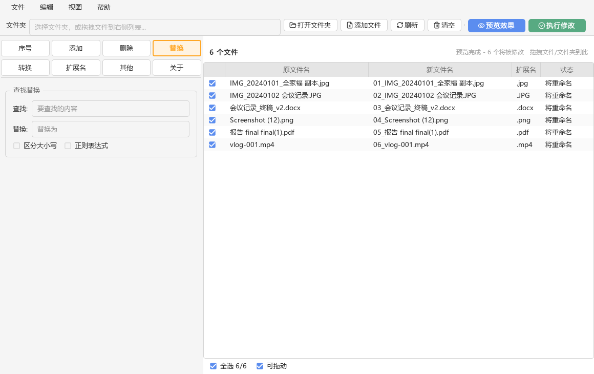
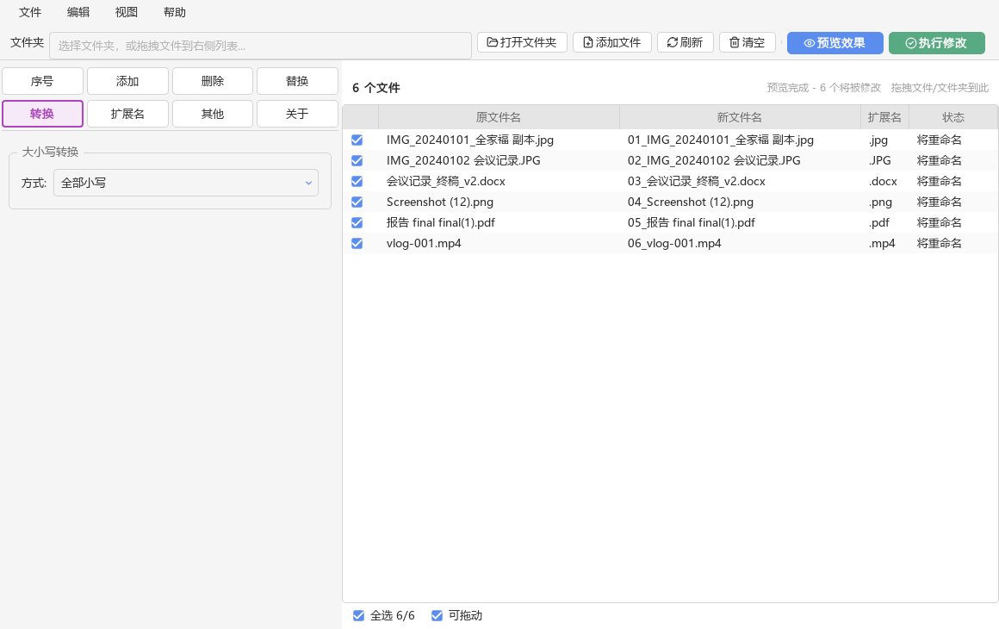
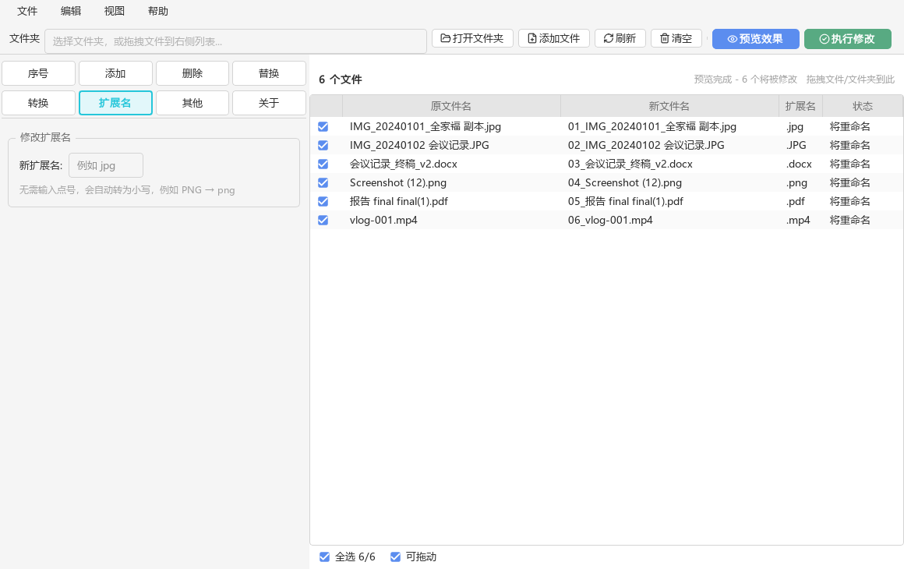
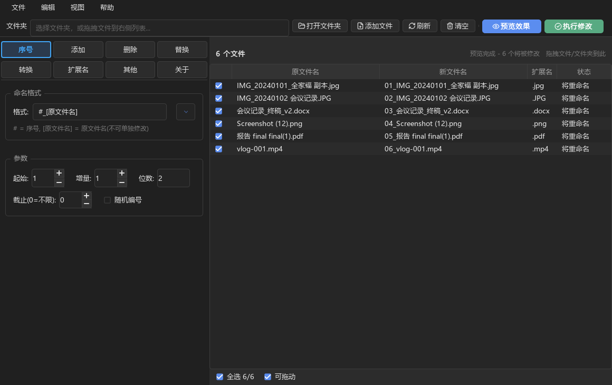

# 吃瓜批量改名器 · File Renaming Assistant

<p align="center"></p>


> 一个基于 **PySide6（LGPL）** 的跨平台批量文件重命名工具。
> 左侧七类命名规则，右侧实时预览；**先预览、再执行、可撤销**，批量改名不再靠赌。

---

## 目录

- [特性](#特性)
- [界面预览](#界面预览)
- [快速开始](#快速开始)
- [规则说明](#规则说明)
- [为什么选择它](#为什么选择它)
- [打包为可执行文件](#打包为可执行文件)
- [项目结构](#项目结构)
- [开发与测试](#开发与测试)
- [常见问题](#常见问题)
- [许可证](#许可证)

---

## 特性

- **七类命名规则**：序号、添加、删除、替换、大小写转换、扩展名、按顺序命名。
- **界面与原版一致**：左侧 4×2 彩色页签、分组框参数区、五列文件表格（含扩展名列），
  逐像素按原版 v4.0 的界面还原。
- **预览与执行分离**：所有改动先以「原文件名 → 新文件名 → 状态」呈现，确认无误再落盘。
- **冲突提前拦截**：目标名已被占用时在**预览阶段**就标成「目标已存在」，
  而不是执行到一半弹一堆失败弹窗。
- **可撤销**：执行后一键还原，采用两阶段提交，连 `A↔B` 这种交换名也能安全撤销。
- **拖拽即用**：支持拖入文件、拖入文件夹、拖入多个路径。
- **自然排序**：`img2` 排在 `img10` 之前，而不是按字典序乱序。
- **深色 / 浅色主题**：`Ctrl+D` 一键切换，弹窗在深色系统下不再「黑底黑字」。
- **检查更新**：「帮助 → 检查更新」联网比对 GitHub 上的最新版本，有新版本时
  直接跳转下载页。
- **纯逻辑内核**：改名引擎零 GUI 依赖，可单独导入进你自己的脚本。
- **跨平台**：Windows、macOS、Linux 均可运行与打包。
- **标准开源图标**：界面图标全部取自 [Lucide](https://lucide.dev)（ISC 协议），
  以 SVG 源码随包分发、**运行时按当前主题着色**，明暗两套主题共用同一份矢量，
  任意缩放都清晰。应用图标则沿用原版《吃瓜批量改名器》的素材，授权说明见
  [许可证](#许可证)。

> **与截图的一处差异**：原版没有状态栏。为了让「预览完成 / 冲突数量」这类反馈
> 有地方显示，本项目把提示文字放在文件列表头部（「N 个文件」与「拖拽文件/文件夹到此」
> 之间的空白处），因此底部布局仍与截图完全一致。

---

## 界面预览

| 序号 | 添加 | 删除 |
|:---:|:---:|:---:|
|  |  |  |

| 替换 | 转换 | 扩展名 |
|:---:|:---:|:---:|
|  |  |  |

深色主题下同样清晰：



---

## 快速开始

### 方式一：直接下载可执行文件（推荐给普通用户）

前往 [Releases](https://github.com/11113234376457548/File-Renaming-Assistant/releases/latest)
下载 `File-Renaming-Assistant.exe`，双击运行，**无需安装 Python**。

### 方式二：从源码运行

需要 Python **3.10 或更高版本**。

```bash
git clone https://github.com/11113234376457548/File-Renaming-Assistant.git
cd File-Renaming-Assistant

python -m venv .venv
# Windows
.venv\Scripts\activate
# macOS / Linux
source .venv/bin/activate

pip install -r requirements.txt
python main.py
```

也可以安装为包后使用命令启动：

```bash
pip install .
file-renaming-assistant
# 或
python -m renamer
```

---

## 规则说明

### 序号

按顺序生成编号。格式串中：

- `#` 会被替换为序号；
- `[原文件名]` 会被替换为原名（不含扩展名）。

参数包括起始值、增量、位数（补零）、截止值（`0` 表示不限）、随机编号。
例：格式 `#_[原文件名]`、位数 `3` → `001_照片.jpg`。

> 序号只随**已勾选**的文件递增，未勾选的文件不占号，因此不会出现 02、04 这种跳号。

### 添加

在文件名**前**、**后**或**指定字符位置**插入文字。三个位置**只能选一个**；
一个都不选则不做改动。选择「指定位置」后，才会出现「在第 N 个字符后」输入框。

### 删除

五种模式：指定文本、开头 N 字符、结尾 N 字符、从前数删除、从后数删除，
**每次只能用一种**。

- 「内容」输入框只在勾选「指定文本」时出现，其余四种模式都不需要填；
- 「开头N字符 / 结尾N字符」的 N 取自自动出现的「字符数」输入框；
- 「从前数删除 / 从后数删除」使用自动出现的「起始位置 + 删除个数」；
- 一个都不选则不做任何删除；
- 删除范围超出文件名长度时自动跳过，**不会产生只剩扩展名的空文件名**。

### 替换

查找并替换文件名主体，可选「区分大小写」与「正则表达式」。扩展名不受影响。

### 转换

全部小写 / 全部大写 / 首字母大写，三种模式**均只作用于文件名主体**。

### 扩展名

替换扩展名。输入会**自动规范化**——去掉多余的点号并统一转小写，
所以填 `PNG`、`.PNG` 都会得到 `.png`；含非法字符（如 `a/b`）或超过 15 字符的
输入会被忽略，不做任何改动。

### 其他

输入若干名称（空格分隔），按顺序依次分配给列表中的文件。

---

## 为什么选择它

相比原始版本 v4.0，本版本修复了 11 个已复现的缺陷，其中若干会导致**数据层面不可接受的后果**：

| 编号 | 缺陷 | 后果 |
|:---:|------|------|
| B1 | 随机编号位数失控 | 位数设 2 却生成 4 位数 |
| B2 | 位数输入框留空 | `int('')` 抛异常，**程序闪退** |
| B3 | 指定文本删除误删扩展名 | `abc.jpg` → `abc.` |
| B4 | 开头/结尾删超额 | 变成 `.jpg`，文件在资源管理器中「消失」 |
| B5 | 从后数删除越界 | 本意不动，实际误删首字符 |
| B6 | 跨目录同名误报冲突 | 不同文件夹的同名文件被跳过 |
| B7 | 大小写转换破坏扩展名 | `.jpg` → `.JPG` |
| B8 | 序号跳号 | 未勾选项也占号 |
| B9 | 交换名执行失败 | `A→B` 且 `B→A` 时后者失败 |
| B10 | 撤销记录临时名 | 撤销后残留 `.renamer_tmp_*` |
| B11 | 非法文件名未拦截 | 生成 `CON.txt`、`a<b.txt` 等非法名 |

### 复刻过程中的第二轮修订

在按界面截图逐像素校准时，又发现并修掉了 3 个**只有在真实操作中才会暴露**的问题：

| 问题 | 现象 | 修复 |
|------|------|------|
| 撤销后列表状态错乱 | 文件已还原，但列表里的路径仍指向新名，再点预览/执行毫无反应 | 撤销前先保存 `现名 → 原名` 映射，撤销后同步回列表 |
| 磁盘同名未预警 | 目标名已被别的文件占用时要到「执行修改」才逐个报错 | `plan_rename` 在预览阶段即判定为「目标已存在」 |
| 位置插入会「偷袭」 | 只填了「在第 N 个字符后」却没勾选「指定位置」，仍会插入 | 必须勾选「指定位置」才按位置插入 |

### 第三轮：图标标准化

原先的界面小图标（微调按钮的 `+ / −`、下拉箭头、复选框）是脚本临时画出来的，
分辨率写死、深色主题还得额外出一套深色版位图。现在全部换成 **Lucide** 矢量图标：
SVG 源文件随包分发，运行时用 `QtSvg` 按当前主题色着色渲染。

顺带修好了一处一直存在的样式缺陷：数字输入框的右侧微调按钮列与输入区
**边框接不上**（两者各画各的，中间断成两截）。现在由基座让出右边框、
两个按钮各自补齐，拼成与原版一致的「一个完整圆角框 + 一条灰底按钮列」。

### 第四轮：按使用反馈调整

软件实际跑起来之后，按使用者的反馈做了一轮交互收敛，并修掉一个会让功能
彻底不可用的缺陷：

| 调整 | 说明 |
|------|------|
| 「文件」菜单精简 | `浏览文件夹` → `打开文件夹`，移除 `刷新`、`退出` |
| 新增「帮助 → 检查更新」 | 联网比对最新版本，后台线程执行，界面不卡 |
| 格式下拉只留四个模板 | `#_[原文件名]`、`#-[原文件名]`、`#[原文件名]`、`#` |
| 添加 / 删除页改单选 | 一组选项框只能勾一个，避免组合出无法预期的结果 |
| 删除页「内容」按需显示 | 只有勾「指定文本」时才出现，其余四种模式不显示 |
| 扩展名自动规范化 | 去掉点号并转小写（`PNG` → `png`），非法输入直接忽略 |
| 对话框统一加宽 | 确认 / 完成等弹窗设了 460px 下限，不再窄成一条缝 |
| 去掉焦点虚线框 | 按钮获得焦点时不再画一圈虚线（`outline: none`） |
| 表格列宽可拖动调节 | 表头分界线可以直接拖，最后一列自动吃掉剩余宽度 |
| 选区勾选 | 按住 Shift 选中多行后点选择框，整个选区一起勾 / 取消 |
| 拖动行带插入指示线 | 拖动重排由数据层接管，表格与文件列表始终同步；拖到边缘会自动滚动 |
| 「可拖动」默认勾选 | 原版一启动就能拖动，只是复选框没同步状态；现在勾选状态说实话 |
| 单元格不再画焦点虚线 | 用委托剥掉焦点状态，键盘方向键不受影响 |
| 关于页不再罗列修复内容 | 只保留版本与功能介绍，也不显示图标图案 |
| 应用图标换回吃瓜图标 | 用回原版素材（`packaging/app_icon_source.png`） |

其中**大小写转换被误报「目标已存在」**值得单独记一笔：Windows 的文件名
不区分大小写，而早先所有「目标是否已被占用」的判断都直接用 `os.path.exists`，
于是把 `ABC.JPG` 转成 `abc.JPG` 时，目标路径其实就是文件自己却被判成冲突，
转换功能等于完全不能用。修复方式是把所有「两个路径是否指向同一个文件」的
比较统一收敛到 `os.path.normcase(os.path.abspath(...))`——Windows 上不区分
大小写、POSIX 上保持大小写敏感，语义各自正确，而不需要写两套分支。

---

## 打包为可执行文件

```bash
pip install -r requirements-dev.txt
python scripts/build_exe.py
```

产物位于 `dist/File-Renaming-Assistant.exe`（Windows）/ 对应的可执行文件（macOS、Linux）。

> 脚本会先清理 `build/` 与 `dist/`。这一步是必须的——PyInstaller 命中缓存时会
> 「只花 2 秒就 Build complete」，但产物其实是旧内容。

推送形如 `v1.0` 的 tag 后，[Release 工作流](.github/workflows/release.yml)
会自动在 Windows 上打包并把可执行文件发布到 Release 页。

---

## 项目结构

```
.
├── main.py                         # 便捷启动脚本（python main.py）
├── src/renamer/
│   ├── app.py                      # QApplication 入口
│   ├── core.py                     # 改名引擎（纯逻辑，零 Qt 依赖）
│   ├── icons.py                    # Lucide 图标：着色、渲染、QSS 位图缓存
│   ├── update.py                   # 检查更新（纯标准库，可单独测试）
│   ├── theme.py                    # 配色与样式表
│   ├── paths.py                    # 资源定位（源码 / 打包兼容）
│   ├── resources/                  # 应用图标 + icons/（Lucide SVG 源文件）
│   └── ui/
│       ├── main_window.py          # 主窗口
│       └── tab_selector.py         # 左侧彩色标签选择器
├── tests/                          # pytest 测试（176 项）
├── scripts/
│   ├── build_exe.py                # 一键打包
│   ├── make_app_icon.py            # 由源图生成应用图标（PNG / ICO）
│   └── screenshot.py               # 生成文档截图
├── packaging/                      # PyInstaller spec + 图标源图
├── docs/                           # 各功能页的浅色 / 深色截图
└── .github/workflows/              # CI 与 Release 流水线
```

核心设计：**引擎与界面彻底解耦**。`core.py` 不导入任何 Qt 模块，
因此可以独立做单元测试，也可以直接嵌入到你自己的批处理脚本里：

```python
from renamer.core import RenameEngine, plan_rename, apply_rename, undo

engine = RenameEngine({"tab": 0, "num_fmt": "#_[原文件名]", "num_digits": 3})
plan = plan_rename([("/path/a.jpg", "a.jpg", True)], engine)
print(plan)      # [('/path/a.jpg', 'a.jpg', '001_a.jpg', '将重命名')]

history = []
apply_rename(plan, history)   # 真正落盘
undo(history)                 # 一键还原
```

---

## 开发与测试

```bash
pip install -r requirements-dev.txt

python -m pytest -q            # 运行 176 项测试
ruff check .                   # 静态检查
python scripts/screenshot.py   # 重新生成文档截图
python scripts/make_app_icon.py  # 由源图重新生成应用图标
```

测试覆盖 B1–B11 的全部缺陷及边界，其中 GUI 冒烟测试在无显示器环境下
通过 `QT_QPA_PLATFORM=offscreen` 运行，因此可直接放进 CI。

贡献指南见 [CONTRIBUTING.md](CONTRIBUTING.md)。

---

## 常见问题

**改完名后能反悔吗？**
可以。执行后点「撤销」，或按 `Ctrl+Z`。

**会不会误改扩展名？**
不会。除「扩展名」页外，其余六页都只处理文件名主体。

**删除字符数填多了会怎样？**
自动跳过，不会生成空文件名。

**为什么我的文件在资源管理器里「消失」了？**
这在原版中会发生（名称只剩扩展名后成为隐藏文件）。本版本已通过最终安全闸拦截。

**「检查更新」提示连不上服务器？**
该功能会访问 GitHub 的 API。网络不通、或仓库尚未发布任何 Release 时会给出提示。
fork 本项目后，请把 `src/renamer/update.py` 里的 `GITHUB_REPO` 改成你自己的
`用户名/仓库名`，否则它查的是上游仓库。

---

## 许可证

本项目以 [MIT 许可证](LICENSE) 发布。

界面框架使用 [PySide6](https://www.qt.io/qt-for-python)（LGPL v3），
因此你可以在保留其许可证声明的前提下自由地二次开发，包括闭源分发。

界面图标来自 [Lucide](https://lucide.dev)，按 **ISC 协议**分发
（其中部分图标源自 [Feather](https://feathericons.com)，MIT 协议）。
完整许可原文见 [`src/renamer/resources/icons/LICENSE`](src/renamer/resources/icons/LICENSE)。
图标是 SVG 源码随包分发、运行时用 `QtSvg` 按主题色重新着色渲染的，
因此改动主题配色不需要重新导出任何位图。

### 应用图标的授权例外

`src/renamer/resources/icon.png`、`app_icon.png`、`icon.ico` 以及源图
`packaging/app_icon_source.png` **不在本项目的 MIT 授权范围内**：它们是原版
《吃瓜批量改名器》所使用的图标素材，本项目按原作者意愿沿用，版权归其
原始权利人所有。如果你要 fork 本项目并再分发，请自行替换这些文件，
或先确认你拥有相应使用权。除此之外的全部代码与 Lucide 图标均按 MIT / ISC 授权。
